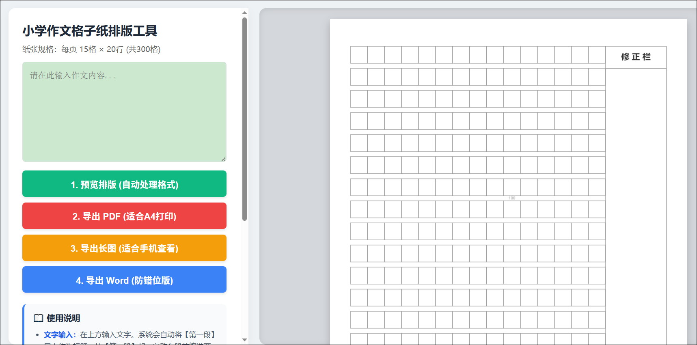
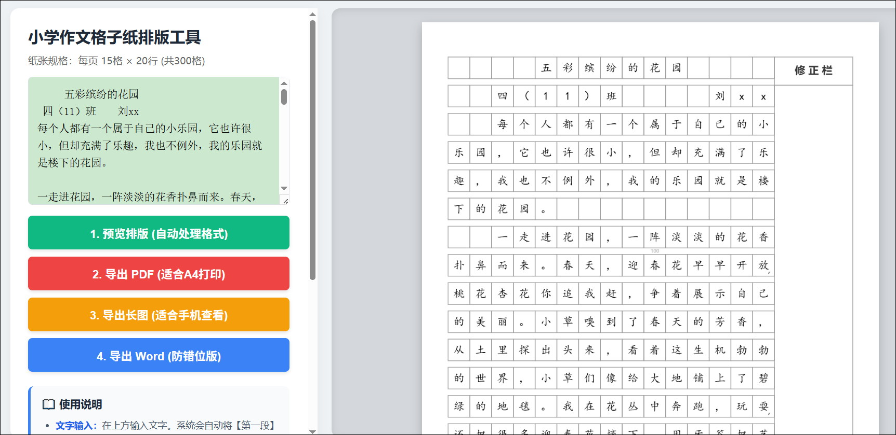

# 小学作文格子纸排版工具 (Composition Grid Generator)

	
	

## 1. 项目背景

本工具为响应学校语文老师的教学倡议而开发。老师希望通过整理班级优秀习作，为孩子们打造一套高质量的“作文范本库”。本项目的核心目的在于：
*   **榜样学习**：通过标准化的格子纸呈现优秀习作，让孩子们能够更直观地欣赏和学习身边同学的优美文笔。
*   **互动互评**：通过预留的“修正栏”区域，鼓励孩子们尝试批改同学的作文。在批改过程中，引导孩子从“写作者”视角切换为“评阅者”视角，深入挖掘他人的优点，取长补短，从而有效提升自身的习作水平。

## 2. 工具功能与特点
本系统采用纯前端 JavaScript 开发，无需安装任何插件，具备以下特性：

*   **专业排版**：严格遵循小学作文本规范，每页 15 格 × 20 行（共 300 格）。
*   **标题智能居中**：自动识别文章第一段为标题，并实现水平居中。
*   **自动段落缩进**：自动为段落首行添加两个全角空格（缩进）。
*   **标点避头尾**：内置专业排版算法，逗号、句号等标点符号绝不会出现在行首，若触发行首则自动压入上一行末尾。
*   **字数统计**：背景网格每满 100 格自动在底部显示浅色数字标记（100, 200, 300...）。
*   **右侧修正栏**：复刻经典作文纸样式，修正栏表头与下方空白框无缝合并，方便批改。
*   **极速导出**：
    *   **PDF**：采用 JPEG 压缩引擎，在保证高清打印效果的同时，将文件体积缩减 90%。
    *   **长图**：支持将多页作文无缝拼接为一张超清长图，方便手机端预览与分享。
    *   **Word**：采用图片嵌入方式，确保打印格式不跑版。

## 3. 使用方式
1.  **打开工具**：在浏览器中直接打开 `zuowen_v6.html` 文件。
2.  **输入文字**：在左侧输入框内粘贴作文内容。
    *   *注：第一行输入标题，后续段落正常换行输入即可。*
3.  **预览排版**：点击【预览排版】按钮，系统会根据字数自动进行多页分页排版。
4.  **导出文件**：
    *   **打印建议**：推荐点击【导出 PDF】，直接连接打印机即可获得专业级的作文本纸张。
    *   **线上分享**：点击【导出长图】，即可得到一张可以直接发到班级群的精美作文图片。
    *   **存档备用**：使用【导出 Word】可将图片分页存入文档，便于老师后续编辑和归档。

## 4. 技术栈
*   **HTML5 Canvas**：用于实现图形化的排版绘制。
*   **jsPDF**：用于将生成的画布转换为多页 PDF 文档。
*   **纯原生 JavaScript**：确保工具在任何现代浏览器中无需后台服务即可稳定运行。

---

### 给老师和家长的建议：
在使用此工具打印作文时，建议使用 A4 纸张，打印机设置选择“实际大小”或“100%缩放”，这样打印出来的格子尺寸最接近真实的作文本，最利于孩子书写和批改。