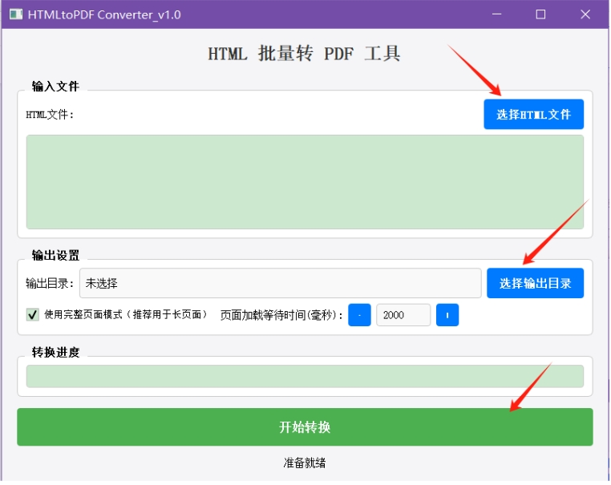

# html批量转pdf小工具（HTMLtoPDF_Converter_v1.0.py）


一个带图形界面的批量 HTML 转 PDF 工具，基于 Python 开发，可一键把单个/多个 HTML 文件高质量转为 PDF，支持长页面、JS 渲染、自定义等待等场景。

<p align="center">
	
</p>

`html-example.zip`为可供测试的样本

---

## 一、整体功能
- 批量选择 HTML/HTM 文件，批量导出为 PDF
- 支持**完整页面长截图模式**（适合超长网页、报表）
- 支持**标准 A4 分页模式**（适合文档、打印）
- 自定义页面加载等待时间（解决 JS 渲染未完成问题）
- 实时进度条、错误提示、转换完成后直接打开输出目录
- 带背景图、CSS 样式、边距、缩放等专业 PDF 输出设置

---

## 二、使用的核心技术
1. **PyQt5**
    构建桌面图形界面（窗口、按钮、列表、进度条、复选框、布局等）
2. **Playwright（异步）**
    无头浏览器渲染 HTML，执行 JS、获取页面高度、生成 PDF
3. **asyncio**
    配合 Playwright 实现异步网页处理
4. **QThread**
    把转换逻辑放到子线程，避免界面卡死
5. **pathlib / os**
    文件路径处理、批量文件管理
6. **pyqtSignal**
    子线程与主线程通信（进度、完成、错误）

---

## 三、功能特点
### 1. 界面友好
- 现代 Fusion 风格，蓝色主题，操作直观
- 分区域：输入文件 → 输出设置 → 转换进度 → 操作按钮

### 2. 批量处理
- 一次选择多个 HTML 文件，自动排队转换
- 列表显示已选文件，清晰明了

### 3. 两种转换模式
- **完整页面模式（默认推荐）**
  自动计算页面真实高度，生成一整页长 PDF，不截断、不分页
  适合：长报表、长文章、网页快照
- **标准 A4 模式**
  按 A4 尺寸分页，尊重 CSS 页面设置
  适合：需要打印、标准文档

### 4. 防渲染失败机制
- 自定义等待时间（毫秒），给 JS/图片/接口足够加载时间
- 双重等待：networkidle + domcontentloaded + 自定义延时

### 5. 专业 PDF 参数
- 打印背景（保留图片/背景色）
- 四周 20px 边距
- 0.9 缩放防内容溢出
- 大视窗（1280px 宽度）保证渲染完整

### 6. 稳定与体验
- 子线程运行，界面不卡顿
- 实时进度条（0–100%）
- 错误弹窗提示具体文件与原因
- 完成后可直接打开输出目录

---

## 四、使用方法
### 1. 环境准备（必须先安装依赖）
```bash
pip install pyqt5 playwright
playwright install chromium
```

### 2. 运行程序
直接运行代码，弹出图形界面。

### 3. 操作步骤
1. **选择 HTML 文件**
   点击「选择 HTML 文件」，可多选 .html/.htm 文件
2. **选择输出目录**
   点击「选择输出目录」，指定 PDF 保存位置
3. **调整设置（可选）**
   - 勾选/取消「完整页面模式」
   - 用 ± 调整**页面加载等待时间**（默认 2000ms）
4. **开始转换**
   点击「开始转换」，等待进度条走完
5. **完成**
   弹窗提示完成，可直接打开输出目录

---

## 五、注意事项
### 1. 必须安装 Playwright 浏览器
只安装库不行，必须执行：
```bash
playwright install chromium
```
否则无法启动浏览器渲染。

### 2. JS 渲染不完全怎么办
- 把**等待时间调大**：3000、5000 毫秒
- 保持勾选「完整页面模式」
- 检查 HTML 是否引用网络资源（网络慢会导致加载失败）

### 3. 长页面内容截断
- 务必使用**完整页面模式**
- 程序会自动计算页面最大高度，避免截断

### 4. 中文/特殊字符乱码
- 确保 HTML 里有 `<meta charset="UTF-8">`
- 系统需安装对应中文字体

### 5. 路径问题
- 不要使用**中文/空格/特殊符号**过多的路径
- 尽量用纯英文路径，避免解析错误

### 6. 性能与内存
- 一次不要转换上百个文件
- 转换大文件/超多图片页面时，等待时间适当加长

### 7. 常见错误
- `无法启动浏览器`：重新安装 playwright
- `文件处理错误`：HTML 损坏、路径不存在、权限不足
- `内容空白`：等待时间太短，JS 未执行

---

## 六、适用场景
- 网页批量存档
- HTML 报表批量导出 PDF
- 长图文、长文章转 PDF
- 带 JS 动态渲染页面的 PDF 输出
- 办公批量转换工具
